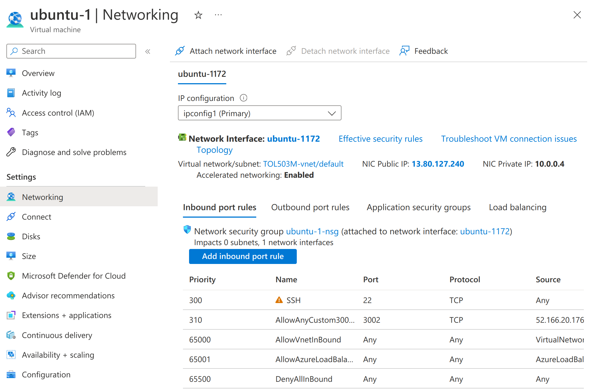
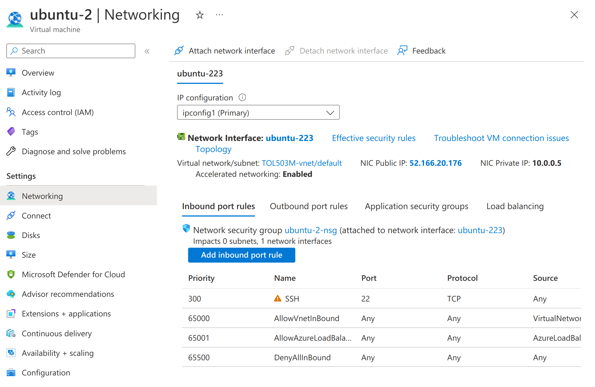
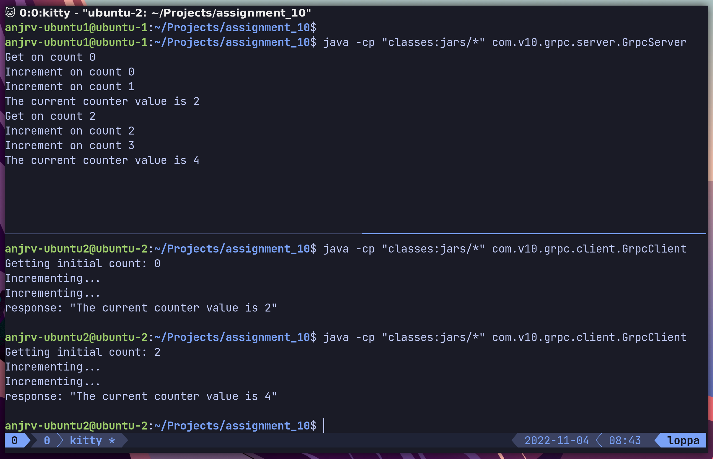
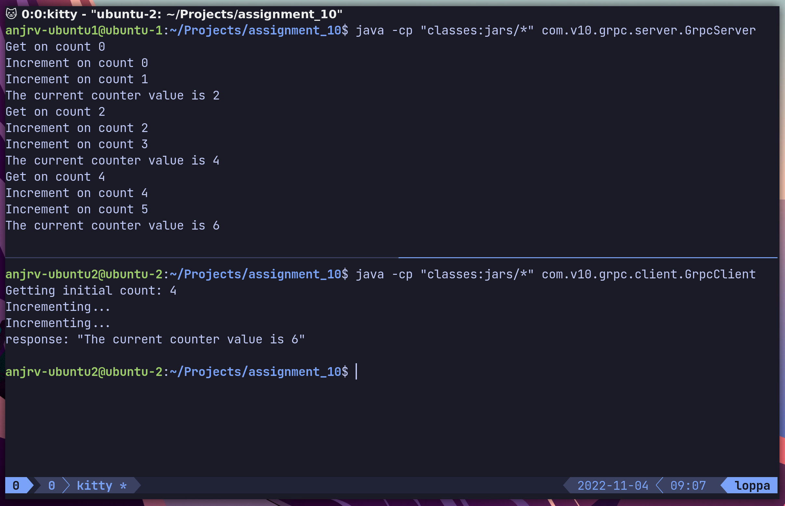
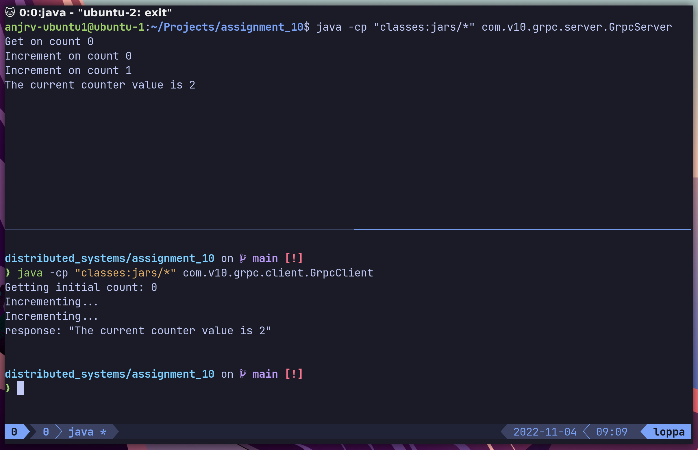

---
geometry: margin=1in
fontsize: 12pt
urlcolor: blue
header-includes: |
    \usepackage[scaled]{beramono}
    \usepackage{setspace}\doublespacing
    \usepackage{float}
    \usepackage{fancyhdr}
    \pagestyle{fancy}
    \floatplacement{figure}{H}
    \lhead{Jaan Jaerving}
    \chead{}
    \rhead{Distributed Systems, Assignment 12}
...

## Azure Virtual Machines

Two Ubuntu virtual machines were created on the same private virtual network. The final network configuration can be seen in the upcoming figures. SSH port was allowed in order to interact with the machines.



The above image describes the networking configuration used on the server. It has a private IP `10.0.0.4` that clients on the same private network can access. And for different networks the TCP port `3002` was added as an allowed inbound port for **Scenario B** and **Scenario C**.

\pagebreak



In this image the networking configuration that was used on the client instance can be seen. No additional ports had to be opened on the client.

\pagebreak

## Scenarios

### Scenario A

For private communication to work all that had to be done was to point the client at the servers virtual network IP. This is equivalent to working on your own local network and pointing devices at `192.168.0.X:3002`. No additional ports have to be opened to make this work.

```java
ManagedChannel channel = ManagedChannelBuilder.forAddress("10.0.0.4", 3002)
        .usePlaintext()
        .build();
```

The following figure shows the client and server processes.



\pagebreak

### Scenario B

In order to use the servers public IP `13.80.127.240` a port for our server process has to be opened. This port `3002` could be seen in the networking configurations earlier. The client does not have to open any additional ports. We can provide additional security by only allowing the client IP `52.166.20.176` and the gRPC client port to make calls to this server port.

```java
ManagedChannel channel = ManagedChannelBuilder.forAddress("13.80.127.240", 3002)
        .usePlaintext()
        .build();
```

The following figure shows the client and server processes.



\pagebreak

### Scenario C 

This is identical to scenario B, the only change we make is that we change the allowed client IP to the public IP of the requesting computer. The following figure shows the client and server processes.



